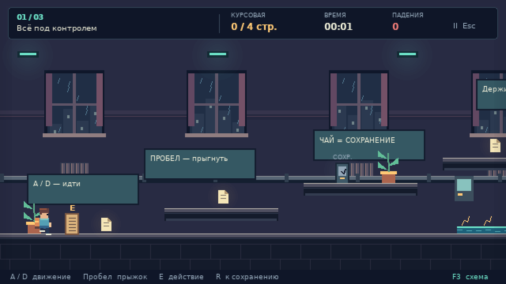

# Общага: пять минут до выселения

Законченный учебный 2D-платформер на **Python + Pygame**. В ночь перед защитой
прорвало трубу, сквозняк разнёс курсовую, а дроны общежития слишком серьёзно
восприняли эвакуацию. Соберите страницы на трёх этажах и доберитесь до друга
с ноутбуком на крыше. Пятиминутного ограничения нет: таймер считает время игры.

В игре есть вступление, главное меню, настройки, пауза, три ручных уровня,
контрольные точки и финал со статистикой. Графика и звуки создаются локально.
Сеть, сторонние сервисы и ключи не нужны.

В меню стоит подпись **byVanoGame**. Добавлены «Набор студента» из трёх бонусов
(билет, кружка и флешка), новые реплики страниц и дополнительные записки.
Бонусы сохраняются после смерти и учитываются в финале; для выхода они не нужны.



## Материалы для защиты в Word

В папке `submission` находятся два готовых документа:

- `Руководство_по_защите_byVanoGame.docx` — подготовка с нуля, скриншоты игры,
  реальные фрагменты кода с номерами строк, объяснение физики, ООП и A*,
  справочник всех 137 явно объявленных функций и методов игрового пакета.
- `Короткая_речь_и_шпаргалка_byVanoGame.docx` — речь примерно на полторы-две
  минуты, порядок демонстрации и быстрые ответы на вопросы.

Начните с речи, затем разберите соответствующие главы руководства и повторите
демонстрацию. Копировать или запоминать весь справочник не требуется.

## Запуск

### Windows — простой способ

1. Установите [Python 3.12](https://www.python.org/downloads/) и при установке
   включите пункт **Add Python to PATH**.
2. Скачайте репозиторий через **Code → Download ZIP** и распакуйте архив.
3. Дважды щёлкните `start.bat`.

При первом запуске сценарий сам создаст `.venv` и установит Pygame. Для этого
один раз понадобится интернет. Он поддерживает команды `py`, `python` и
`python3`. Следующие запуски работают без сети.

### Запуск вручную

Из PowerShell в папке проекта выполните:

```powershell
py -3.12 -m venv .venv
.\.venv\Scripts\python.exe -m pip install -r requirements.txt
.\.venv\Scripts\python.exe main.py
```

Папку `.venv` между компьютерами переносить не нужно: она создаётся локально.

Linux/macOS:

```sh
python3 -m venv .venv
.venv/bin/python -m pip install -r requirements.txt
.venv/bin/python main.py
```

Исходный код требует Python 3.10 или новее; проверенная конфигурация — Windows,
Python 3.12.14, Pygame 2.6.1. В текущем окружении системная команда `python`
ведёт на ярлык Microsoft Store, поэтому выше указан настоящий интерпретатор.

## Управление

| Клавиши | Действие |
| --- | --- |
| A / D, ← / → | Бежать |
| Пробел | Прыгнуть; раннее отпускание уменьшает высоту |
| E | Прочитать записку или открыть выход |
| Escape | Пауза / назад |
| R | Вернуться к контрольной точке; учитывается как смерть |
| F3 | Диагностика физики и A* |
| M | Выключить / включить весь звук |
| F11 | Полный экран / окно |
| ↑ / ↓, Enter или мышь | Выбрать пункт меню |

Страницы подбираются касанием и сохраняются после смерти. Терминал с чайником
автоматически активирует контрольную точку. Выход помечен стрелкой; он требует
все страницы текущего этажа и нажатие E. Уже собранное видно в HUD. При нехватке
страниц выход сообщает точное число. Записки необязательны.

В настройках можно отключить звук, музыку и тряску, уменьшить эффекты.
Окно масштабируется с сохранением пропорций 16:9. Внутренняя поверхность —
640×360; используется ближайший сосед, по краям другого формата остаются полосы.

## Три этажа

1. **«Первый этаж. Всё под контролем»** — безопасный старт, четыре страницы,
   ступени, записки и знакомство с сохранением.
2. **«Комендантский час»** — четыре страницы, горизонтальная грузовая решётка,
   патруль и дрон. Между героем и дроном есть стена с нижним обходом.
3. **«До крыши рукой подать»** — пять страниц, охранник на маршруте,
   вертикальный подъёмник, дрон и выход на крышу.

Грузовые решётки несут героя и сталкиваются с ним со всех сторон. Для небольших
дронов решётки проницаемы; они не входят в навигационную сетку. Охранники
патрулируют только отведённые статические площадки. Опасная вода имеет зубцы
и предупреждающие знаки; объекты различаются формой, а не только цветом.

## Структура проекта

```text
main.py                     точка входа Pygame-приложения
start.bat                   запуск подготовленного окружения Windows
requirements.txt            единственная зависимость: pygame==2.6.1
dormgame/
  config.py                 скорости, размеры, таймеры, фиксированный шаг
  geometry.py               дробный AABB без Pygame
  commands.py               неизменяемая команда одного шага
  physics.py                spatial grid, движение по осям, прыжки, платформы
  pathfinding.py            навигационная сетка, компоненты, самостоятельный A*
  enemies.py                Enemy → PatrolEnemy / DroneEnemy
  levels.py                 загрузка и проверка формата карт
  model.py                  игровые правила, предметы, события, сеанс
  timing.py                 аккумулятор времени и очередь фронтов ввода
  app.py                    окно, ввод, экранные состояния, игровой цикл
  presentation.py           камера, спрайты, HUD, меню, эффекты, F3
  audio.py                  локальный синтез звуков и фонового лупа
data/level1.json ... level3.json  ручные карты
assets/fonts/               кириллический шрифт и его лицензия
tests/                      unittest-тесты чистой логики
tools/verify_routes.py      воспроизводимая проверка маршрутов
DEFENSE.md                  рассказ для защиты и таблица критериев
```

`GameSession` хранит правила и выдаёт `GameEvent`; графический слой реагирует
частицами, сообщениями и звуками. Модель не знает о меню, пикселях экрана или
клавишах Pygame. Приложение переводит события устройства в `Commands`.
Физика и AI работают с собственным `AABB`, без окна и импорта Pygame.
Чистую логику можно проверить даже с `python -S`, без site-packages.

## Физика и порядок шага

Координаты и скорости — `float`; целочисленные `pygame.Rect` создаются только
при рисовании. В модели единицы измерения — пиксели и секунды.

1. Увеличивается игровое время, уменьшаются защита и задержка R.
2. Обновляются кинематические платформы; запоминаются их `dx`, `dy`.
3. Герой получает ввод, проверяет опору и буфер прыжка, переносится опорой,
   разрешает зажатия, ускоряется и движется с коллизиями.
4. Каждый враг обновляется через единый `Enemy.update`.
5. Проверяются смерть, предметы, контрольная точка и взаимодействия.

Смерть немедленно возвращает к сохранённому месту, сбрасывает врагов и фазу
платформ. Страницы сохраняются. После появления действует 1,2 секунды защиты
от контакта с врагом/водой; R имеет задержку 0,45 секунды. Защита не позволяет
оставаться зажатым в геометрии: зажатие или выпадение всё равно вызывает возврат.

`move_body` дробит смещение на отрезки не больше 3 пикселей. На каждом сначала
разрешает X, затем Y. `_move_axis` проверяет **весь осевой промежуток** до
ближайшей поверхности, поэтому даже плита тоньше подшага не пропускается.
Этот вариант проще общего swept AABB с поиском времени столкновения и подходит
для прямоугольных платформ без склонов. Удар о потолок обнуляет скорость вверх,
пол — скорость вниз. Малый запрос под ногами заново определяет `grounded`.

На движущейся платформе запоминается `support_id`. После обновления платформы
герой переносится на её смещение с проверкой статических стен. Прыжок снимает
связь с опорой. При неразрешимом зажатии выдаётся `crushed`, затем единственная
смерть и возврат: дрожания от многократных выталкиваний нет.

Горизонтальная скорость стремится к ±150 пикселей/с с ускорением 1100;
торможение без ввода — 1500 пикселей/с². Гравитация 850 пикселей/с², предельное
падение 440, начальная скорость прыжка −310. При отпускании прыжка скорость
вверх ограничивается −125.

`coyote_timer` даёт 0,105 секунды после ухода с края. `jump_buffer_timer`
запоминает нажатие на 0,105 секунды до приземления. Один фронт тратится один раз:
удержание не порождает новые прыжки. `InputBuffer` сохраняет порядок коротких
нажатий и отпусканий до доступного шага, включая кадры вообще без симуляции.

`FixedStepper` накапливает реальное время и вызывает модель с шагом 1/120 с.
Кадр ограничен 0,1 с, догоняющих шагов не больше 12. После долгого зависания
лишнее время отбрасывается; игра не пытается догнать его бесконечной нагрузкой.
В паузе модель не обновляется, аккумулятор и старый ввод очищаются. Продолжение
не переносит время, проведённое в меню, в физику.

## Проверка прыжков

Непрерывная оценка полного прыжка:

```text
h = v² / (2g) = 310² / (2 × 850) ≈ 56,53 пикселя
t = 2v / g ≈ 0,729 секунды
дальность при полном разбеге = 150 × t ≈ 109,41 пикселя
```

Реальная симуляция с полунеявным интегрированием при 120 Гц даёт около
55,24 пикселя высоты и 108,75 пикселя дальности. Стандартная ступень поднимается
на 32 пикселя; между краями большинства последовательных площадок 32 пикселя.
Для поднятой площадки нельзя использовать дальность приземления на прежней
высоте: нужен запас на более раннюю встречу с верхней поверхностью. Критические
переходы и грузовые платформы проверяются реальными шагами симуляции в
`tools/verify_routes.py`; карты не генерируются случайно.

## A* и поведение врагов

`Enemy` — абстрактный класс с общим жизненным циклом `update` / `reset` и
абстрактным `update_behavior`. `PatrolEnemy` использует гравитацию и `Body`
через композицию, проверяет стену и пол перед носом и разворачивается.
`DroneEnemy` сам управляет полётом; ненужной наземной физики в базовом классе нет.
Модель вызывает общий контракт без цепочек `isinstance`.

Состояния дрона: «Патруль», «Погоня», «Возвращение». Обнаружение — по расстоянию
180 пикселей, потеря цели — 245; дрон намеренно замечает игрока через стену,
но летит вокруг неё. Его скорость 65 пикселей/с, герой значительно быстрее.
Путь пересчитывается раз в 0,45 секунды, при смене состояния или смещении цели
не меньше чем на три клетки, а не каждый кадр.

`NavigationGrid` строит граф центров клеток 16×16. У каждой свободной клетки
достаточно места для корпуса дрона 18×14. Также проверяется весь объём перехода
между соседями: безопасных концов недостаточно при тонкой стене между ними.
Есть только четыре осевых направления с ценой 1. Предварительные компоненты
связности позволяют при недоступной клетке игрока выбрать ближайший к нему
по евклидову расстоянию центр **в компоненте дрона**, до которого путь существует.

`astar` использует `heapq`, `g_score`, `came_from` и манхэттенскую эвристику.
При улучшении расстояния в кучу добавляется новая запись; устаревшая запись
отбрасывается по сохранённому `g`. Путь восстанавливается от цели и разворачивается.
Недостижимость возвращает пустой список; совпадение старта и цели — одну клетку.
Во время полёта дополнительно проверяются физические стены через spatial grid.
При пересчёте посреди ребра сохраняется его ближайший безопасный конец, чтобы
дрон не срезал угол. Нет пути — нет движения сквозь препятствие.

В F3 показаны коллайдеры, локальная сетка, путь, состояние врага, количество
раскрытых узлов последнего поиска, FPS и число шагов текущего кадра. Всё рисуется
в `presentation.py`; алгоритм A* ничего не знает об отладочной графике.

### Сложность именно этой реализации

| Операция | Время | Память / оговорка |
| --- | --- | --- |
| A* | O((V + E) log V), здесь E ≤ 4V, поэтому O(V log V) | O(V + E), включая устаревшие записи кучи |
| Восстановление пути | O(L) | O(L), L — число клеток пути |
| Построение навигации | O(C·S + V log V) | O(C + S); выполняется при загрузке уровня |
| Компоненты связности | O(V + E) | O(V) |
| Выбор точки приближения | O(Vₖ) в худшем случае | Vₖ — размер компоненты дрона; для доступной клетки проверка O(1) в среднем |
| Статический spatial grid: запрос | O(Q + K) в среднем | Q — посещённые клетки, K — прочитанные ссылки на стены, включая повторы |

V — свободные вершины навигации, E — рёбра, C — все клетки карты, S — статические
прямоугольники. В построении навигации текущая реализация один раз сравнивает
клетки и рёбра со всеми S стенами; сортировка свободных клеток добавляет V log V.
Это не поиск по всем стенам на каждом игровом шаге.

Физическая сетка имеет шаг 24. При её создании каждый прямоугольник добавляется
во все покрываемые клетки. Пусть B — суммарное число этих записей: построение
стоит O(S + B), память O(S + B). В запросе `set` убирает повторные ссылки, после
чего выполняется точный AABB-тест. Весь запрос **не O(1)**; хеш-операции считаются
в среднем O(1). Стоимость движения умножается на число подшагов, а немногочисленные
динамические платформы проверяются отдельным списком. Для длинного пути удаление
первого элемента списка маршрута дрона стоит O(L); коротким картам этого достаточно.

## ООП и принципы

- **Абстракция:** `Enemy` задаёт обязательный контракт поведения; `Commands`
  скрывает устройство ввода, `GameEvent` — способ показа результата.
- **Наследование и полиморфизм:** два врага имеют общий жизненный цикл, но
  разные алгоритмы движения; общий цикл модели вызывает `enemy.update`.
- **Инкапсуляция:** очереди ввода, ячейки spatial grid, фаза платформы и внутренние
  состояния маршрута изменяются через методы. Публичные координаты модели
  сознательно остаются простыми данными, не маскируются бессмысленными getter/setter.
- **DRY:** одна осевая физика, одна структура AABB, один поиск A*, общие кэши текста
  и спрайтов; параметры вынесены в конфигурацию.
- **KISS:** три ручных JSON-карты, два врага, обычные dataclass и unittest;
  нет универсального движка, ECS, плагинов или глубокой иерархии.
- **SOLID соразмерно задаче:** правила, физика, AI и представление разделены;
  новый подкласс врага вписывается в общий цикл, тело используется через
  композицию. Данные и простые числовые настройки не обёрнуты лишними интерфейсами.

Таблица критериев с баллами и конкретными доказательствами находится в
`DEFENSE.md`. Она помогает подготовиться к защите, но не гарантирует оценку.

## Проверки

```powershell
.\.venv\Scripts\python.exe -m unittest discover -v
.\.venv\Scripts\python.exe -m tools.verify_routes
.\.venv\Scripts\python.exe main.py --smoke --frames 120
.\.venv\Scripts\python.exe -m tools.verify_pygame
.\.venv\Scripts\python.exe -m tools.verify_pygame --native
```

`unittest` покрывает пол/стену/потолок, тонкие платформы, coyote time, буфер,
однократное нажатие, перенос и зажатие платформой, предметы, восстановление,
закрытый выход, паузу, переходы, формат уровней, A* против BFS и поведение врагов.
Проверки событий предметов намеренно устанавливают положение рядом с объектом;
они проверяют правила, а не являются доказательством проходимости маршрута.
Для последнего служит отдельная воспроизводимая симуляция.

Дымовая проверка с dummy SDL проверяет инициализацию, цикл и отрисовку без
настоящего устройства. Её нельзя выдавать за ручное прохождение. Итог реально
выполненных проверок записан в `CHECKS.md`.

`verify_pygame` дополнительно проходит весь сеанс через буфер ввода приложения,
проверяет меню, паузу, настройки, переходы, изменение пропорций окна и новую
игру. `--native` открывает настоящее окно SDL; оба варианта управляются кодом.
Кадры и результаты сохраняются в `artifacts/`. Для быстрой демонстрации ИИ:

```powershell
.\.venv\Scripts\python.exe main.py --level 2 --debug
```

## Ресурсы и ограничения

Персонаж с рюкзаком, охранник, дрон, страницы, растения, окна, дождь и предметы
быта рисуются средствами Pygame. Повторяющиеся спрайты, текст и свечения
кэшируются; частицы ограничены по количеству. Звуки прыжка, приземления, страницы,
сохранения, обнаружения и победы, а также собственный музыкальный луп синтезируются
в памяти. При отсутствии аудиоустройства игра продолжает работать без звука.
DejaVu Sans с кириллицей поставляется вместе с лицензией; есть системные резервные
шрифты. Авторские внешние изображения и сетевые ресурсы не требуются.

Это небольшая учебная игра. Нет склонов, односторонних платформ, сохранения
прохождения между запусками или редактора карт. Настройки сохраняются в
`~/.obshchaga/settings.json`; при недоступности записи остаются в памяти.
Защитные механизмы и карты рассчитаны на фиксированный шаг 120 Гц;
произвольно большие dt не являются режимом работы модели. При очень сильном
зависании отброшенное время не включается в игровой таймер. Геометрия навигации
учитывает статические стены, а грузовые решётки намеренно проницаемы для дронов.
Полноценное ручное прохождение с оценкой удобства человеком остаётся отдельной
проверкой от автоматических тестов и просмотра отрисованных кадров.
